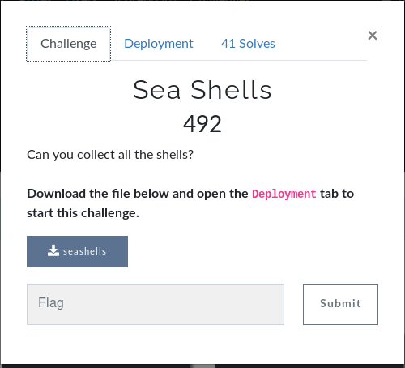

# Sea Shells



Connection with `nc challenge.ctf.games 30398` and we get this:
```bash
user@kali:~/Documents/BesidesbosCTF/Binary_Exploitation/Sea_Shells$ nc challenge.ctf.games 30398
0x7ffecd890420
How many sea shells did Sally sell by the sea shore?: 2
Nope
```
We also get a file `seashells` :
```bash
user@kali:~/Documents/BesidesbosCTF/Binary_Exploitation/Sea_Shells$ file seashells 
seashells: ELF 64-bit LSB executable, x86-64, version 1 (SYSV), dynamically linked, interpreter /lib64/ld-linux-x86-64.so.2, BuildID[sha1]=b7d9c428ee2fff8e524e24b028a3dd693aa185f3, for GNU/Linux 3.2.0, not stripped
```

He is `not stripped` so we can have some comments in the programm.
