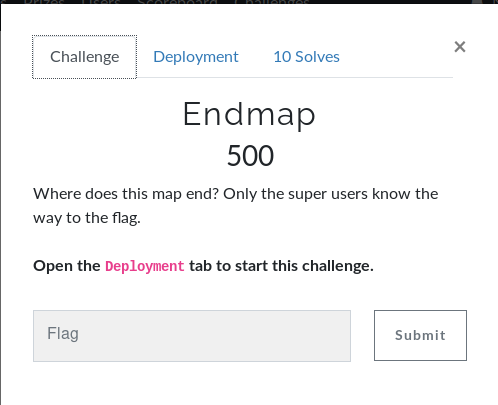

# Endmap



So we get this `nc challenge.ctf.games 30326`:
```bash
user@kali:~/Documents/BesidesbosCTF/Misc/Endmap$ nc challenge.ctf.games 30326
bash: no job control in this shell
user@endmap-3fcddd596f8a1ad4-7ddbdbc6cb-bpdgb:~$ id
id
uid=1000(user) gid=1000(user) groups=1000(user)
user@endmap-3fcddd596f8a1ad4-7ddbdbc6cb-bpdgb:~$ ls
ls
map.txt
user@endmap-3fcddd596f8a1ad4-7ddbdbc6cb-bpdgb:~$ cat map.txt
cat map.txt
127.0.0.1: you are here
192.168.1.1: router/gateway
???.???.???.???: ????????
```
