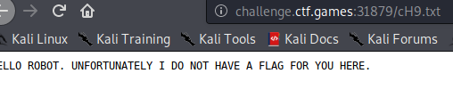

# Robot Takeover


So we get this on the robot.txt file. But this file is regenerated each time we reload it.


And when we go to one of these file, we get :


This message appear if we go to the wrong file AND if we don't change ou user-agent depending of the robots.txt.

And when we change our user-agent (for exemple with BurpSuite) we get a new message `REJOICE, ROBOT. THE CHARACTER OF THE FLAG AT INDEX 9 IS THE SAME CHARACTER AT INDEX 2 IN THIS FILENAME.` or also `REJOICE, ROBOT. THE CHARACTER OF THE FLAG AT INDEX 17 IS THE SAME CHARACTER AT INDEX 1 IN THIS FILENAME.` !!

So we understand that we need to write a script, python for me, with theses features :
	* Retrieve the `robots.txt`
	* Parse the `robots.txt`
	* Request the disallowed file with the right user-agent
	* Get the sentences and get the 2 numbers.
	* Fill the flag

I sized the flag list with a maximum of 50 characters.
And I writed the following script.py :
```python
import requests

URL = "http://challenge.ctf.games:30095/"

l_robots = "robots.txt"

flag = [""]*50
while 1:
	r = requests.get(url=URL+l_robots)

	robots_txt = r.text

	lst_robots_txt = robots_txt.split("\n")
	etat = True
	for i in lst_robots_txt:
		if not i == "":
			if i[0] == 'U':	# We define the user-agent to use
				headers = {"User-Agent": i[12:]}
			else:	# Then we do the GET request
				i = i[11:]
				r = requests.get(url=URL+i, headers=headers)
				resp = r.text
				if resp.startswith("REJOICE"):	# If the response begin with REJOICE we extract the 2 numbers
					number = []
					for words in resp.split():
						if words.isdigit():
							number.append(int(words))
					flag[number[0]] = i[number[1]]	# We fill the flag

		if len("".join(flag)) == 34:	# If the flag is complete (I knew that there was 34 characters with test at the begining)
			print("".join(flag))
			exit(1)
```

And we get the flag when the script stop :
```bash
user@kali:~/Documents/BesidesbosCTF/Scripting/Robot_Takeover$ python3 script.py
flag{beepboop_are_you_a_robot_too}
```