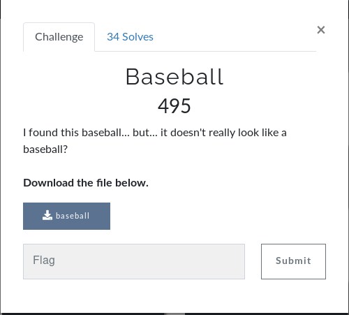

# Baseball



We get a file `baseball`.

We do a simple file on it and it's an ASCII text.

```bash
user@kali:~/Documents/BesidesbosCTF/Baseball$ cat baseball 
TzRaVUNVMlRNRTRIQTZMSFBGWkdTNVpTSzVZVU1ZSllIQk5ER00zREdKTkhBVTJWSkJHVkNWMllPRlVFSzMyRE9GTUVNMkNaR0Y1RU1VUlpNUlNHS1JSWE9CQ1VVU1pZSk4ySEFWVFVPVTJGQzJDV000WlUyUVNHSlpBVFNNUT0=
```

It's in base64, so pretty simple :
```bash
user@kali:~/Documents/BesidesbosCTF/Baseball$ cat baseball | base64 -d
O4ZUCU2TME4HA6LHPFZGS5ZSK5YUMYJYHBNDGM3DGJNHAU2VJBGVCV2YOFUEK32DOFMEM2CZGF5EMURZMRSGKRRXOBCUUSZYJN2HAVTUOU2FC2CWM4ZU2QSGJZATSMQ=
```
So now it's a base58 :
```bash
user@kali:~/Documents/BesidesbosCTF/Baseball$ cat baseball | base64 -d | base58 -d
flag{wow_you_hit_a_homerun_and_really_ran_the_bases_there} 
```

That's it !!