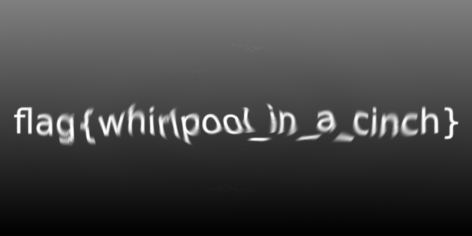

# Kiddie_pool

We have a `kiddie_pool.png` where we can see that

We can see that there is a rotation of a text.
By using Gimp, we just have to rotate in the other way with the tool `Filters>Distorts>Whirls and Pinch`
Results :

And we get the flag `flag{whirlpool_in_a_cinch}`