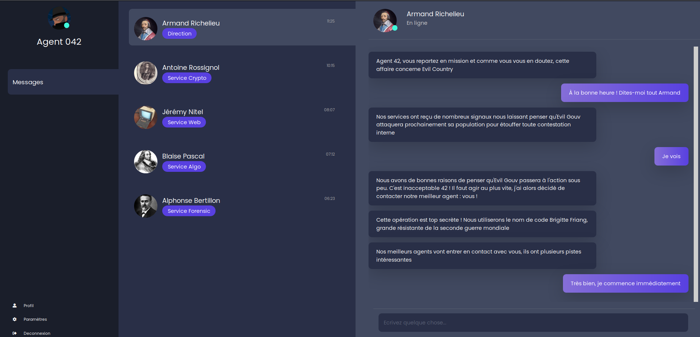
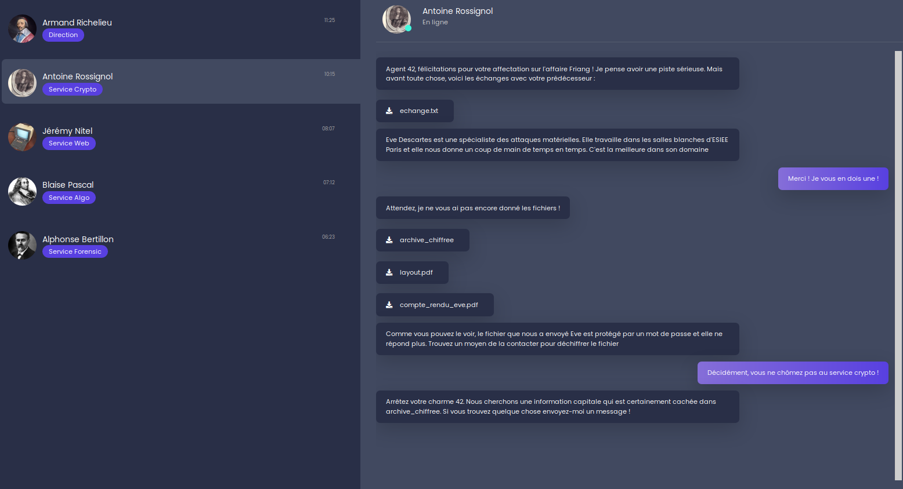
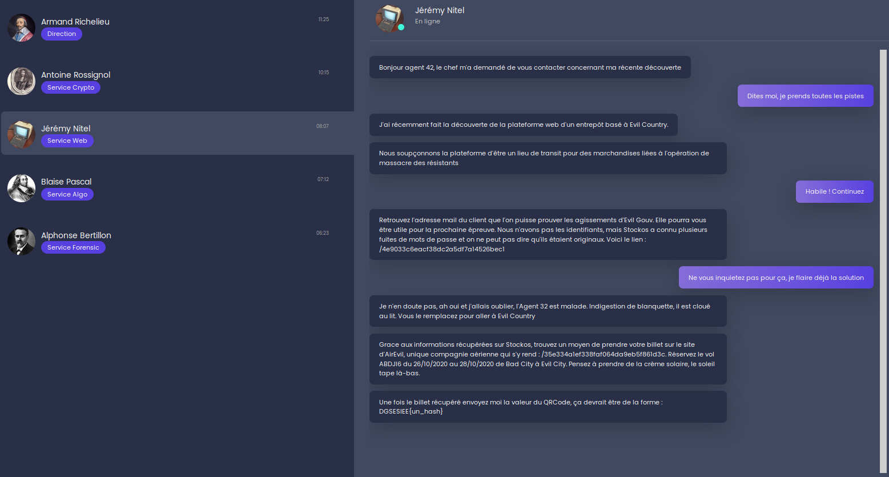
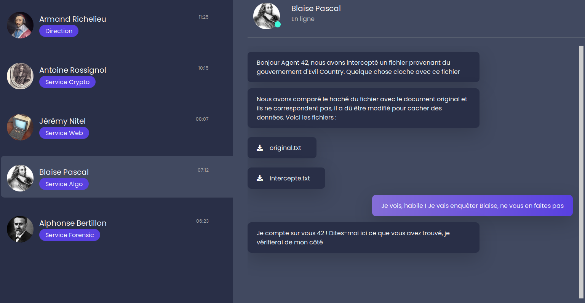
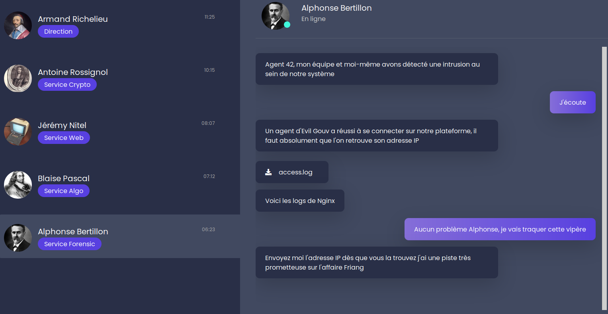
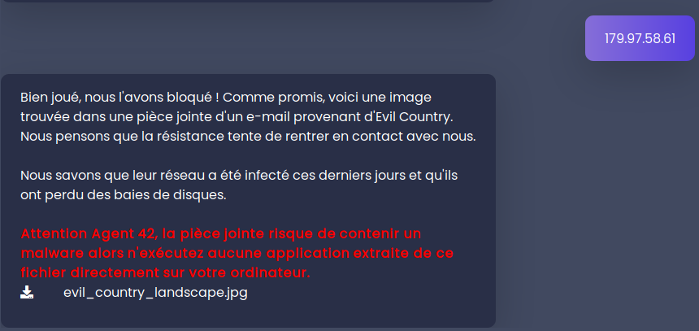
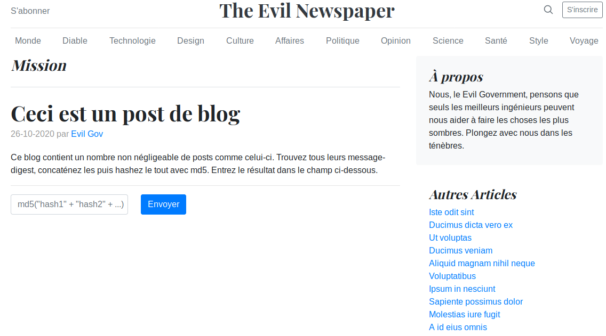

# Challenge Cybersec Brigitte Friang by DGSE x ESIEE

Cybersec challenge organized by DGSE and ESIEE Paris.
Date of launch : 24/10/2020 0h01
Date of end : 11/11/2020

## The LINK
`https://challengecybersec.fr/`


## First chall

Go to code source of the page and we get the comment
```
<!--/static/message-secret.html-->
```
And so we go to the url `https://challengecybersec.fr/static/message-secret.html` and we get a page with a title "Cesar" and this text :
Note : The characters between `**` are in bold on the page (in the code source between `<b></b>`)

```
Zp cvbz whyclulg h spyl jl tlzzhnl, j'lza xbl cvbz wvbclg ylqvpukyl s’vwlyhapvu «Iypnpaal Myphun». Ylqvpnulg-uvbz yhwpkltlua.

Iypnpaal Myphun lza bul ylzpzahual, qvbyuhspzal la ljypchpul myhujhpzl. Lssl lza ull sl 23**/**01/1924 h Whypz, lssl h 19 huz zvbz s'vj**j**bwhapvu svyzxb'lssl lza yljyball wbpz mvytll jvttl zljylahpyl/jopmmylbzl why bu hnlua kb IJYH, Qlhu-Myhujvpz Jsvbla klz Wlyybjolz hsphz Nhspsll jolm kb Ibylhb klz vwlyhapvuz hlypluulz (IVH) kl sh Ylnpvu T (Jval kb Uvyk, Mpupzalyl, Pukyl la Svpyl, Vyul, Zhyaol, Svpyl pumlyplbyl, Thpul la Svpyl, Tvyip**o**hu, Clukll). Iypnpaal Myphun bapspzl whymvpz klz mvbshykz wvby jhjoly klz jvklz. Jvtwslalg s’BYS hclj s’pumvythapvu xbp lza jhjoll khuz jl tlzzhnl.

Zbpal h s’hyylzahapvu la sh ayhopzvu kl Wplyyl Thubls, Iypnpaal Myphun lza hyylall why sh Nlzahwv. Lssl lza islzzll why ihssl lu aluahua kl z’lumbpy la lza jvukbpal h s’Ovwpahs kl sh Wpapl. Klz ylzpzahuaz alualyvua kl sh spilyly thpz zhuz zbjjlz. Lssl lza avyabyll la ul kvuulyh whz k'pumvythapvuz. U’vbisplg whz sh ihyyl vispxbl. Lssl lza luzbpal lucvfll khuz sl jhtw kl Yhcluziybjr.

Hwylz zvu ylavby kl klwvyahapvu, lssl whyapjpwl h sh jylhapvu kb Yhzzltisltlua kb wlbwsl myhuçhpz (YWM). Lssl pualnyl sh wlapal lxbpwl, hbavby k'Hukyl T**h**syhbe, xbp ch wylwhyly sl kpzjvbyz mvukhalby kl Zayhzivbyn lu 1947 la slz lsljapvuz slnpzshapclz kl 1951.

Lssl yluayl h s'VYAM, la klcplu**a** jvyylzwvukhual kl nblyyl. Lssl viaplua zvu iylcla kl zhba lu whyhjobal la hjjvtwhnul klz jvtthukvz kl whyhjobapzalz lu vwlyhapvu kbyhua sh nblyyl k’Pukvjopul. Lssl yhjvual zvu lewlyplujl khuz Slz Mslbyz kb jpls (1955). K'hbaylz hnluaz zvua zby sl jvbw hb tvtlua vb ql cvbz whysl. Slz tlpsslbyz k'luayl cvbz zl kvuulyvua yluklg-cvbz h s'Lbyvwlhu Jfilydllr h Yluulz wvby bul yltpzl kl wype. Ylzvsclg sl wsbz k'lwylbclz hchua sh mpu kl jlaal tpzzpvu la alualg kl nhnuly cvayl wshjl whytp s'lspal! Why sh zbpal, lssl jvbcyl s’lewlkpapvu kl Zblg, sh nblyyl klz Zpe Qvbyz la sh nblyyl kb Cpla Uht. Lssl wyluk wvzpapvu lu mhclby k'bul hbavuvtpl kb qvbyuhspztl khuz sl zlycpjl wbispj jl xbp sbp chba k'layl spjlujpll kl s'VYAM.

Lssl ljypa wsbzplbyz spcylz la altvpnul kl s'lunhnltlua klz mlttlz khuz sh Ylzpzahujl.
```

So we can think of Caesar cypher we can test some shifting and it's rot7 : 
```
$ user@kali:~/Documents/BrigitteFriand$ cat chall1/chall1.txt | tr ‘h-za-gH-ZA-G’ ‘a-zA-Z’


Si vous parvenez a lire ce message, c'est que vous pouvez rejoindre l’operation «Brigitte Friang». Rejoignez-nous rapidement.

Brigitte Friang est une resistante, journaliste et ecrivaine francaise. Elle est nee le 23/01/1924 a Paris, elle a 19 ans sous l'occupation lorsqu'elle est recrutee puis formee comme secretaire/chiffreuse par un agent du BCRA, Jean-Francois Clouet des Perruches alias Galilee chef du Bureau des operations aeriennes (BOA) de la Region M (Cote du Nord, Finistere, Indre et Loire, Orne, Sarthe, Loire inferieure, Maine et Loire, Morbihan, Vendee). Brigitte Friang utilise parfois des foulards pour cacher des codes. Completez l’URL avec l’information qui est cachee dans ce message.

Suite a l’arrestation et la trahison de Pierre Manuel, Brigitte Friang est arretee par la Gestapo. Elle est blessee par balle en tentant de s’enfuir et est conduite a l’Hopital de la Pitie. Des resistants tenteront de la liberer mais sans succes. Elle est torturee et ne donnera pas d'informations. N’oubliez pas la barre oblique. Elle est ensuite envoyee dans le camp de Ravensbruck.

Apres son retour de deportation, elle participe a la creation du Rassemblement du peuple français (RPF). Elle integre la petite equipe, autour d'Andre Malraux, qui va preparer le discours fondateur de Strasbourg en 1947 et les elections legislatives de 1951.

Elle rentre a l'ORTF, et devient correspondante de guerre. Elle obtient son brevet de saut en parachute et accompagne des commandos de parachutistes en operation durant la guerre d’Indochine. Elle raconte son experience dans Les Fleurs du ciel (1955). D'autres agents sont sur le coup au moment ou je vous parle. Les meilleurs d'entre vous se donneront rendez-vous a l'European Cyberweek a Rennes pour une remise de prix. Resolvez le plus d'epreuves avant la fin de cette mission et tentez de gagner votre place parmi l'elite! Par la suite, elle couvre l’expedition de Suez, la guerre des Six Jours et la guerre du Viet Nam. Elle prend position en faveur d'une autonomie du journalisme dans le service public ce qui lui vaut d'etre licenciee de l'ORTF.

Elle ecrit plusieurs livres et temoigne de l'engagement des femmes dans la Resistance.

```
So with this message we know that an URL is hidden in the text.
With the bolds characters we get `/joha` which is `/chat` after rot7 !!

## Some challs

So now we now that we need to go to `https://challengecybersec.fr/chat` (with a page title S3curConv).

Here is a screenshot of what we get, different discussion with :
Discussion with Richelieu :

With this conv we know that we are Agent 42 and we need to fight against Evil Country !

Discussion with Rossignol :

With this conv we got some files (placed in my rossignol directory). And we are asked that if we got the password in the `archive_chiffree` we need to send him a message.

Discussion with Nitel :

Need to connect to `/4e9033c6eacf38dc2a5df7a14526bec1` to retrieve mail address from a client to prove Evil Gouv deeds. 
Then we need to take a flight to Evil Country on the site `/35e334a1ef338faf064da9eb5f861d3c`. Need to reserve the flight `ABDJI6 26/10/2020 au 28/10/2020 de Bad City à Evil City`.

Discussion with Pascal :

We got 2 files (placed in my pascal directory). We also need to send him our answers to this response.

Discussion with Bertillon :

We got one log file. We need to search for the IP of an Evil Gouv Agent in it. And we need to send it to Bertillon.

### The Rossignol chall
So we want to have access to the `layout.pdf`. I used `john` and the binary `pdf2john.pl` to crack it.
I obtained the password `resistance`.

Here is another solution much more fun : YOU can REALLY try to send her an email (in the `compte_rendu_eve.pdf`) but it reply automatically that she is not available.
But you can also call her and we got a morse code. Just note it and decode it and we get the pass `resistance`.


With the layout we can see 256 fuses either broken or not. Maybe if the fuse is ok, the bit is equal to 1 and if broken, bit equal to 0 ???

As they (Eve Descartes and his team) cannot be sure of the order of the bits and the position of the MSB, I think that we need to write a scipt that detect the state of the fuse and try all the possibilities on the `archive_chiffree` with a one standard algo ?

So with eyes we can assume that a fuse no destroyed is 1 and destroyed 0. And we get :
```
1011111010111010
1010110011011111
1100110111001010
1100100111011111
1011101010111100
1011110111011111
1101111111011111
1101111111011111
1101111111011111
1101111111011111
1011110111011111
1101111111011111
1101111111011111
1101111111011111
1101111111011111
1101111111011111
```

But nothing, we can try to invert 0 and 1 :
```
01000001 01000101 01010011 00100000 00110010 00110101 00110110 00100000 01000101 01000011 01000010 00100000 00100000 00100000 00100000 00100000 00100000 00100000 00100000 00100000 01000010 00100000 00100000 00100000 00100000 00100000 00100000 00100000 00100000 00100000 00100000 00100000
```
And we got in ASCII `AES 256 ECB`.

So we can conclude that the `archive_chiffree` is cyphered with the algorithm AES 256 ECB.

I have tried different things, but nothing worth to note it.


### The Bertillon chall
So we got the logs of an NGINX server. And we need to retrieve the IP of the Evil Gouv Agent.
When we open the logs, it's pretty messy (2018 lines !):
```bash
user@kali:~/Documents/BrigitteFriand/bertillon$ wc -l access.log 
2018 access.log
user@kali:~/Documents/BrigitteFriand/bertillon$ head access.log 
166.194.89.135 - - [Nov 04 2020 11:05:43] "POST /login HTTP/1.1" 200 59 "-" "Mozilla/5.0 (Windows; U; Windows NT 6.1; fr; rv:1.8.1.20) Gecko/20081217 Firefox/2.0.0.20"
174.231.146.50 - - [Nov 04 2020 11:06:33] "GET /js/script.js HTTP/1.1" 200 23 "-" "Mozilla/5.0 (X11; Linux x86_64; rv:2.0.1) Gecko/20100101 Firefox/4.0.1"
155.43.49.98 - - [Nov 04 2020 11:07:40] "GET /home HTTP/1.1" 200 201 "-" "Mozilla/5.0 (Android; Tablet; rv:19.0) Gecko/19.0 Firefox/19.0"
174.231.146.50 - - [Nov 04 2020 11:08:48] "POST /login HTTP/1.1" 200 48 "-" "Mozilla/5.0 (Windows NT 10.0; Win64; x64) AppleWebKit/537.36 (KHTML, like Gecko) Chrome/42.0.2311.135 Safari/537.36 Edge/12.246"
184.2.142.43 - - [Nov 04 2020 11:10:25] "GET /contact HTTP/1.1" 200 400 "-" "Mozilla/5.0 (X11; Ubuntu; Linux x86_64; rv:78.0) Gecko/20100101 Firefox/78.0"
174.231.146.50 - - [Nov 04 2020 11:12:01] "GET /img/logo.ico HTTP/1.1" 200 228 "-" "Mozilla/5.0 (iPhone; CPU iPhone OS 12_0 like Mac OS X) AppleWebKit/605.1.15 (KHTML, like Gecko) Version/12.0 Mobile/15E148 Safari/604.1"
142.98.150.84 - - [Nov 04 2020 11:13:27] "GET /img/team.jpeg HTTP/1.1" 200 296 "-" "Mozilla/5.0 (Android; Tablet; rv:19.0) Gecko/19.0 Firefox/19.0"
135.29.196.114 - - [Nov 04 2020 11:15:18] "GET /reviews/01/ HTTP/1.1" 200 374 "-" "Mozilla/5.0 (X11; Linux x86_64; rv:2.0.1) Gecko/20100101 Firefox/4.0.1"
135.29.196.114 - - [Nov 04 2020 11:17:11] "GET /home HTTP/1.1" 200 44 "-" "Mozilla/5.0 (Windows; U; Windows NT 6.1; fr; rv:1.8.1.20) Gecko/20081217 Firefox/2.0.0.20"
168.5.236.18 - - [Nov 04 2020 11:17:41] "POST /login HTTP/1.1" 200 116 "-" "Mozilla/5.0 (X11; Ubuntu; Linux x86_64; rv:78.0) Gecko/20100101 Firefox/78.0"

```

So what I tried is to just get the file retrieved by the user, sort them and get only one of each :
```bash
user@kali:~/Documents/BrigitteFriand/bertillon$ cat access.log | awk '{print $9}' | sort | uniq

/agent-list
/contact
/css/bootstrap.min.css
/css/style.css
/fontawesome/css/all.min.css
/home
/img/image.jpg
/img/logo.ico
/img/team.jpeg
/js/bootstrap.min.js
/js/script.js
/login
/logout
/reviews/01/
```
By this we only get 14 lines.
One weird access is the `/agent-list`. So we just have to grep it but we get too many lines with too many IPs. So false lead.

What I did after, is to see the different browser that they use with this IP :
```bash
user@kali:~/Documents/BrigitteFriand/bertillon$ cat access.log | awk '{print $14 $15}' | sort | uniq 
"EvilBrowser"
"Mozilla/5.0(Android;
"Mozilla/5.0(iPhone;
"Mozilla/5.0(Windows
"Mozilla/5.0(Windows;
"Mozilla/5.0(X11;
```

And we get one `EvilBrowser` that's it !
```bash
user@kali:~/Documents/BrigitteFriand/bertillon$ cat access.log | grep Evil
179.97.58.61 - - [Nov 05 2020 16:22:20] "POST /login HTTP/1.1" 200 476 "-" "Evil Browser"
```
And we get his IP : `179.97.58.61`

So we send the IP to our friend Bertillon :


So we download this image. But it's an heavy png !!

```bash
user@kali:~/Documents/BrigitteFriand/bertillon$ ls -latr evil_country_landscape.jpg 
-rw-r--r-- 1 user user 317286928 Oct 19 17:45 evil_country_landscape.jpg
```
here is why it's this heavy :
```bash
user@kali:~/Documents/BrigitteFriand/bertillon$ binwalk evil_country_landscape.jpg 

DECIMAL       HEXADECIMAL     DESCRIPTION
--------------------------------------------------------------------------------
0             0x0             JPEG image data, JFIF standard 1.01
79798         0x137B6         Zip archive data, at least v2.0 to extract, uncompressed size: 173015040, name: part2.img
4775856       0x48DFB0        Zlib compressed data, best compression
34737670      0x2120E06       MySQL MISAM compressed data file Version 1
56164092      0x358FEFC       IMG0 (VxWorks) header, size: 257308484
128298187     0x7A5ACCB       Cisco IOS microcode, for "w%"
158637081     0x9749C19       Zip archive data, at least v2.0 to extract, uncompressed size: 173015040, name: part3.img
239002530     0xE3EE3A2       Zlib compressed data, best compression
317286906     0x12E969FA      End of Zip archive, footer length: 22
```
Far too much things in it !!

We can see that there is 2 files, `part2.img` and `part3.img` so if we unzip the image we got these 2 image.
```bash
user@kali:~/Documents/BrigitteFriand/bertillon/extract_evil_country_landscape.jpg$ file part*
part2.img: Linux Software RAID version 1.2 (1) UUID=dfaa645a:19afec72:60f1fa33:30d841da name=user-XPS-15-9570:6 level=5 disks=3
part3.img: Linux Software RAID version 1.2 (1) UUID=dfaa645a:19afec72:60f1fa33:30d841da name=user-XPS-15-9570:6 level=5 disks=3
```
So it's 2 disks of 3 which are in raid 5.
As we know raid, if we want to know the full content, we need to find the `part1.img`.


#### part2.img and part3.img

We can unzip `evil_country_landscape.jpg` and we get `part2.img` and `part3.img` :
```bash
user@kali:~/Documents/BrigitteFriand/bertillon/extract_evil_country_landscape.jpg$ file part2.img part3.img 
part2.img: Linux Software RAID version 1.2 (1) UUID=dfaa645a:19afec72:60f1fa33:30d841da name=user-XPS-15-9570:6 level=5 disks=3
part3.img: Linux Software RAID version 1.2 (1) UUID=dfaa645a:19afec72:60f1fa33:30d841da name=user-XPS-15-9570:6 level=5 disks=3
```

```bash
user@kali:/mnt/hgfs/ShareFolder_VM/BrigitteFriand/bertillon/extract_evil_country_landscape.jpg$ sudo losetup /dev/loop1 part2.img
user@kali:/mnt/hgfs/ShareFolder_VM/BrigitteFriand/bertillon/extract_evil_country_landscape.jpg$ sudo losetup /dev/loop2 part3.img
user@kali:/mnt/hgfs/ShareFolder_VM/BrigitteFriand/bertillon/extract_evil_country_landscape.jpg$ sudo mount /dev/md127 /mnt/ctf
```
And we get a `dump.zip`. I copied in my working directory.
When we unzip `dump.zip` we get 2 files `dump.vmem` and `dump.vmem.sha256`.
```bash
user@kali:/mnt/hgfs/ShareFolder_VM/BrigitteFriand/bertillon/extract_evil_country_landscape.jpg$ file dump.vmem*
dump.vmem:        data
dump.vmem.sha256: ASCII text, with no line terminators
```
Just use `sha256sum` to check if we got the right sum and if the dump is not corrupted.

#### The VMEM file

To analyse this vmem I'll use Volatility.
```bash
user@kali:/mnt/hgfs/ShareFolder_VM/BrigitteFriand/bertillon/extract_evil_country_landscape.jpg$ volatility -f dump.vmem imageinfo
Volatility Foundation Volatility Framework 2.6
INFO    : volatility.debug    : Determining profile based on KDBG search...
          Suggested Profile(s) : Win7SP1x64, Win7SP0x64, Win2008R2SP0x64, Win2008R2SP1x64_24000, Win2008R2SP1x64_23418, Win2008R2SP1x64, Win7SP1x64_24000, Win7SP1x64_23418
                     AS Layer1 : WindowsAMD64PagedMemory (Kernel AS)
                     AS Layer2 : FileAddressSpace (/mnt/hgfs/ShareFolder_VM/BrigitteFriand/bertillon/extract_evil_country_landscape.jpg/dump.vmem)
                      PAE type : No PAE
                           DTB : 0x187000L
                          KDBG : 0xf80002c4c0a0L
          Number of Processors : 1
     Image Type (Service Pack) : 1
                KPCR for CPU 0 : 0xfffff80002c4dd00L
             KUSER_SHARED_DATA : 0xfffff78000000000L
           Image date and time : 2020-10-05 11:17:37 UTC+0000
     Image local date and time : 2020-10-05 13:17:37 +0200
```

We try to see what can we find in it.
```bash
user@kali:/mnt/hgfs/ShareFolder_VM/BrigitteFriand/bertillon/extract_evil_country_landscape.jpg$ volatility -f dump.vmem --profile=Win7SP1x64 pslist
Volatility Foundation Volatility Framework 2.6
Offset(V)          Name                    PID   PPID   Thds     Hnds   Sess  Wow64 Start                          Exit                          
------------------ -------------------- ------ ------ ------ -------- ------ ------ ------------------------------ ------------------------------
0xfffffa8000cc5b30 System                    4      0     87      393 ------      0 2020-10-05 11:13:41 UTC+0000                                 
[.........]                             
0xfffffa8000e91b30 drpbx.exe              2304   2916      8      149      1      0 2020-10-05 11:17:01 UTC+0000                                 
0xfffffa8000e78920 taskhost.exe           2464    504      6       88      1      0 2020-10-05 11:17:08 UTC+0000                                 
0xfffffa800107c6a0 WmiApSrv.exe           2632    504      7      119      0      0 2020-10-05 11:17:18 UTC+0000                                 
0xfffffa8001072060 notepad.exe            1880   1084      1       62      1      0 2020-10-05 11:17:36 UTC+0000                                 
0xfffffa800117db30 cmd.exe                1744   1584      0 --------      0      0 2020-10-05 11:17:37 UTC+0000   2020-10-05 11:17:37 UTC+0000  
[.........]
```

So we can see the `drpbx.exe` process which is a process which launch Jigsaw Ransomware. This ransomware cypher files and end them with a `.evil`.
When we search a little on Internet we find that he replicates himself with the process `firefox.exe`.
Next we can list dlls used by this process :
```bash
user@kali:/mnt/hgfs/ShareFolder_VM/BrigitteFriand/bertillon/extract_evil_country_landscape.jpg$ volatility -f dump.vmem --profile=Win7SP1x64 dlllist -p 2304
Volatility Foundation Volatility Framework 2.6
************************************************************************
drpbx.exe pid:   2304
Command line : "C:\Users\user\AppData\Local\Drpbx\drpbx.exe" C:\Users\user\Documents\Firefox_installer.exe
Service Pack 1

Base                             Size          LoadCount LoadTime                       Path
------------------ ------------------ ------------------ ------------------------------ ----
[............]
0x000007fefd250000             0xf000                0x2 2020-10-05 11:17:01 UTC+0000   C:\Windows\system32\CRYPTBASE.dll
[............]
0x000007fefcbd0000            0x17000                0x1 2020-10-05 11:17:01 UTC+0000   C:\Windows\system32\CRYPTSP.dll
[............]
```

And we see 2 suspicious dll named `CRYPTBASE.dll` and `CRYPTSP.dll`.
Then we dump the process :
```bash
user@kali:/mnt/hgfs/ShareFolder_VM/BrigitteFriand/bertillon/extract_evil_country_landscape.jpg$ volatility -f dump.vmem --profile=Win7SP1x64 procdump -p 2304 --dump-dir vol_dump/
Volatility Foundation Volatility Framework 2.6
Process(V)         ImageBase          Name                 Result
------------------ ------------------ -------------------- ------
0xfffffa8000e91b30 0x0000000000870000 drpbx.exe            OK: executable.2304.exe
user@kali:/mnt/hgfs/ShareFolder_VM/BrigitteFriand/bertillon/extract_evil_country_landscape.jpg$ file vol_dump/executable.2304.exe 
vol_dump/executable.2304.exe: PE32+ executable (GUI) Intel 80386 Mono/.Net assembly, for MS Windows
```

So we can decompile this executable, and search the password used for encryption. For this I used AvalonyaILSpy.
Then if we go `Main>Config`, we can see the password used : 
```
internal const string EncryptionPassword = "RXZpbERlZmF1bHRQYXNzIQ==";
```
And if we decode this base64 we get `EvilDefaultPass!`.

Remember the `notepad.exe` process, we can assume that their message is in it.
```bash
user@kali:/mnt/hgfs/ShareFolder_VM/BrigitteFriand/bertillon/extract_evil_country_landscape.jpg$ volatility -f dump.vmem --profile=Win7SP1x64 cmdline
[..........]
************************************************************************
notepad.exe pid:   1880
Command line : "C:\Windows\system32\NOTEPAD.EXE" C:\Users\user\Documents\informations_attaque.txt.evil
[..........]
```
So we search the file `C:\Users\user\Documents\informations_attaque.txt.evil` :
```bash
user@kali:/mnt/hgfs/ShareFolder_VM/BrigitteFriand/bertillon/extract_evil_country_landscape.jpg$ volatility -f dump.vmem --profile=Win7SP1x64 filescan | grep attaque
Volatility Foundation Volatility Framework 2.6
0x000000001715ed50     16      0 R--r-- \Device\HarddiskVolume1\Users\user\Documents\informations_attaque.txt.evil
```
We dump the file :
```bash
user@kali:/mnt/hgfs/ShareFolder_VM/BrigitteFriand/bertillon/extract_evil_country_landscape.jpg$ volatility -f dump.vmem --profile=Win7SP1x64 dumpfiles -Q 0x000000001715ed50 -u -n -D vol_dump/
Volatility Foundation Volatility Framework 2.6
DataSectionObject 0x1715ed50   None   \Device\HarddiskVolume1\Users\user\Documents\informations_attaque.txt.evil
user@kali:/mnt/hgfs/ShareFolder_VM/BrigitteFriand/bertillon/extract_evil_country_landscape.jpg$ file vol_dump/*
vol_dump/executable.2304.exe:                                            PE32+ executable (GUI) Intel 80386 Mono/.Net assembly, for MS Windows
vol_dump/file.None.0xfffffa800e9fec60.informations_attaque.txt.evil.dat: data
```

If we try to use `openssl` or others tools to decrypt the file, we can't.

I wanted to try to rewrite the algorithm that is used by the ransomware but didn't have enough time ;).


### The Pascal chall

#### Difference between 2 files

So we got two files `original.txt` and `intercepte.txt`. For example on the first lines :
```bash
user@kali:~/Documents/BrigitteFriand/pascal$ head original.txt intercepte.txt 
==> original.txt <==
HEALTH ASPECTS

OF
CHEMICAL AND BIOLOGICAL
WEAPONS
Report of a WHO Group of Consultants

WORLD HEALTH ORGANiZATION
GENEVA
1970

==> intercepte.txt <==
HbEALTH ASPECTS

aOF
CsHEMIeCAL6 AND4 BIOLOGICAL:
W/EAPONS
Rep9ortj of a /WHO Group4 of CoAnsultants

WORLAD HEALTQH SORGANiZkATZIONJ
GENEVA
R19g70
```

So I tried different way to get only the characters which are in the file `intercepte.txt`, with `diff`, `cmp`.
After that I decided to write my script in python. 
The first test was with the function `ndiff()` from `difflib` module but there was some location where there was problems ...
So after this I wrote this script:
```python
#! /usr/bin/env python3

from difflib import ndiff

with open('original.txt', 'r') as f:
	original = f.read().replace("\n", "").replace(" ", "")
with open('intercepte.txt', 'r') as f:
	intercepte = f.read().replace("\n", "").replace(" ", "")


truc_diff = []
j = 0
for i in range(len(intercepte)):
	if i < len(original):
		if intercepte[i] == original[j]:
			j += 1
		else:
			truc_diff.append(intercepte[i])
# Or after testing i know that the begining is "base64:" so i remove this when I print it.
data = "".join(truc_diff[7:])
# We need to take care of the padding that we get
missing_padding = len(data) % 4
if missing_padding:
    data += '='* (4 - missing_padding)

print(data)
```

And it remains to launch `script.py` :
```bash
user@kali:~/Documents/BrigitteFriand/pascal$ python3 script.py | base64 -d > out
user@kali:~/Documents/BrigitteFriand/pascal$ file out
out: JPEG image data, JFIF standard 1.01, resolution (DPI), density 72x72, segment length 16, progressive, precision 8, 596x842, components 3
```

AANNNND :


And we got a new link : `/22aeee05cb8b2a49133be134a5e9432`

So we got a new file : `archive.zip`. And we have to complete small exercices.

#### Archive exercices

So we have to write a script that do what they want and we get this link `/9bcb53d26eab7e9e08cc9ffae4396b48`.

I used 2 script, because the last 2 exercices where big. So I had to write a second program that did the samething but in a different way.


#### An histoire of hash and md5

We get this page :


Pretty explicit just to find all articles and get the hash written in it.
And there are a little too much of post that have so what I did is :

* get all post (we can see that the url for all post is in the form of `https://challengecybersec.fr/9bcb53d26eab7e9e08cc9ffae4396b48/blog/post/<some_number>`)
	After some tries, we can see that the first post is 1 and all other posts is an incrementation. So I tried to see the maximum, which is 1000.

* write a script that retrieve all message-digest hashes.

```python
#! /bin/bash

import requests
import hashlib
import multiprocessing as mp


url = "https://challengecybersec.fr/9bcb53d26eab7e9e08cc9ffae4396b48/blog/post/"


def process(i):
	print(f"[+] Request post {i}")
	r = requests.get(url+str(i))
	with open('hashes.txt', 'a') as f:
    	f.write("\n"+r.text.split('<span id="partial-proof">')[1][:32])

number_of_post = 1000
somme = ""
dataset = [i+1 for i in range(number_of_post)]

print(f"We have {mp.cpu_count()} cpu")

with mp.Pool(processes=mp.cpu_count()) as pool:
    result = pool.map(process, dataset, 1)
    
result = "".join(result)
print("The result is :")
print(result)
print()
print()
print("Your md5 is :")
print("=>", hashlib.md5(result.encode()).hexdigest())
```

I just requeted all posts, then concatenate the hash retrieved and process the `md5` of what we get.
When I tested, it took forever to request only 10 posts so I multiprocessed the tasks. It was the occasion to learn how to multiprocess function ;)
/!\ You need to choose a synchronous execution because the md5 will depend on what you give, on the order that you concatenate hashes !!
I wrote each hashes at the end of the files `hashes.txt` in case there is some requests that didn't work.


So we get final md5 : `a0bf8521cfb24944e15fcce434c5771d`.

And finally we get this link `/1410e53b7550c466c76fc7268a8160ae`.

#### And a login page
We find a login page :


When we search in the source code for any things we see `onclick` with this script :
```js
<script>
	function DisplayValidity(strIn) {
	    var str = document.getElementById(strIn).value;
	    if(_0x10dbec(str) == 0){
	        document.getElementById("out").innerHTML = '<div class="alert alert-danger">Identifiants invalides</div>';
	    }
	    else{
	        document.getElementById("out").innerHTML = '<div class="alert alert-success">Identifiants valides !</div>';
	        document.location.href = window.location.href + "/" + str;
	    }
	}
</script>
```
a `login.js` obfuscated of course (otherwise it would be too easy) (with the function `_0x10dbec`) and in this :
```js
var _0x19fd = function PocketDropEvent(ballNumber, opt_target) {
    ballNumber = ballNumber - 0;
    var ball = _0x5f46[ballNumber];
    return ball;
};

function _0x10dbec(searchDefinition) {
    var river = _0x19fd("0x0");
    var _0x4e7c63 = 0;
    var stripTerrain = _0x4bf1ad(_0x53e54e(searchDefinition));
    if (stripTerrain == river) {
        _0x4e7c63 = 1;
    } else {
        _0x4e7c63 = 0;
    }
    return _0x4e7c63;
}

function _0x44d925() {
    var _0x44809b = [2, 21, 0, 34, 11, 9, 23, 30, 14, 5, 29, 4, 24, 22, 8, 20, 31, 17, 38, 35, 15, 1, 13, 6, 12, 26, 25, 27, 33, 10, 7, 16, 32, 28, 3, 19, 37, 36, 18, 39];
    return _0x44809b;
}

function _0x22f9d2() {
    var _0xb974a1 = [0, 21, 0, 34, 4, 9, 23, 30, 14, 5, 29, 4, 24, 22, 8, 20, 31, 17, 38, 35, 15, 1, 13, 6, 12, 26, 25, 27, 33, 10, 7, 16, 32, 28, 3, 19, 37, 36, 18, 39];
    return _0xb974a1;
}

function _0xdbb8b3() {
    var _0x22dcfa = [0, 21, 0, 34, 4, 9, 23, 7, 14, 5, 29, 4, 24, 13, 8, 20, 31, 17, 38, 35, 15, 1, 13, 6, 12, 26, 25, 27, 33, 10, 7, 16, 32, 28, 3, 19, 37, 36, 18, 39];
    return _0x22dcfa;
}

function _0x33903e(value) {
    var enc = _0x44d925();
    var arr = _0x19fd("0x1");
    var i = 0;
    var iter = arr[_0x19fd("0x2")];
    for (; value[_0x19fd("0x2")] < 40;) {
        value = value + arr[i++];
        if (i >= iter) {
            i = 0;
        }
    }
    var o = value[_0x19fd("0x3")]("");
    i = 0;
    for (; i < o[_0x19fd("0x2")]; i++) {
        o[enc[i]] = value[_0x19fd("0x4")](i);
    }
    return o[_0x19fd("0x5")]("");
}

function _0x53e54e(d) {
    var e = _0x22f9d2();
    var tiledImageBRs = _0x19fd("0x1");
    var b = 0;
    var tiledImageBR = tiledImageBRs[_0x19fd("0x2")];
    for (; d[_0x19fd("0x2")] < 40;) {
        d = d + tiledImageBRs[b++];
        if (b >= tiledImageBR) {
            b = 0;
        }
    }
    var a = d["split"]("");
    b = 0;
    for (; b < a["length"]; b++) {
        a[e[b]] = d[_0x19fd("0x4")](b);
    }
    return a["join"]("");
}

function _0x4bf1ad($this) {
    var PL$6 = _0x19fd("0x6");
    var PL$13 = $this[_0x19fd("0x3")]("");
    var artistTrack = 0;
    var PL$17 = 0;
    for (; PL$17 < PL$13["length"]; PL$17++) {
        artistTrack = $this[_0x19fd("0x7")](PL$17) ^ PL$6[_0x19fd("0x7")](PL$17) & 15;
        PL$13[PL$17] = String[_0x19fd("0x8")](artistTrack);
        if (artistTrack < 32 || artistTrack > 126) {}
    }
    return PL$13[_0x19fd("0x5")]("");
};
```


I'm pretty bad with web and js things so I prefered to move on to another challenge in the meantime. 


### The Nitel chall


#### Stockos Plateform

On the stock echange `/4e9033c6eacf38dc2a5df7a14526bec1`, we get access with the simple credentials `admin:admin`.

I'm pretty sure that we need to use an SQL Injection on the page that shows the different items but didn't success.

```sql
SELECT * FROM ??? 
WHERE Objet="entry"
ORDER BY ASC
```


#### Evil Air Plateform

We create a account with a temporary mail.
And when we want to reserve the ticket, they said that we aren't allowed to take plain.
That we need to go to the ambassy and ask pass.

Didn't success on this one too.


## Conclusion

For one of my first CTF, I loved it, the challenges were very interesting. 

